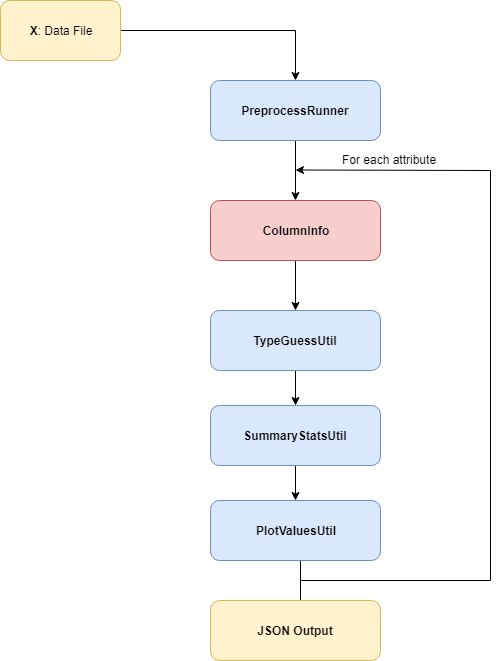

API Documentation
=================

This document describes the detailed information of the API we provided.

Overview
--------

Below is the workflow graph of our service. We will go through each component in detail.

PreprocessRunner
----------------

PreprocessRunner is the most fundamental component in our service. It handles the input data frame, stores the task configuration
and executes the actual variable analysis function. There are two ways to initialize a *PreprocessRunner*, one is:

.. code-block:: python1

    from preprocess_runner import PreprocessRunner
    from msg_util import msg, msgt
    ...
    runner, err_msg = PreprocessRunner.load_from_file(in_file, out_file)
    # in_file & out_file is the path of corresponding file
    # out_file is None by default
    if err_msg:
        msgt(err_msg)
        return

    runner.show_final_info()

Other one is more straightforward, for example:

.. code-block:: python2

    from preprocess_runner import PreprocessRunner
    import pandas as pd
    ...
    runner = PreprocessRunner(dataframe)
    # dataframe is a Pandas.Dataframe, you can create such entity by yourself.
    runner.run_preprocess()
    runner.show_final_info()
    ...

Please refer to :ref:`PreprocessRunner` for more information.

:ref:`ColumnInfo`
------------------

:ref:`TypeGuessUtil`
--------------------

:ref:`SummaryStateUtil`
-----------------------

:ref:`PlotValueUtil`
----------------------
* :ref:`test_ref`
